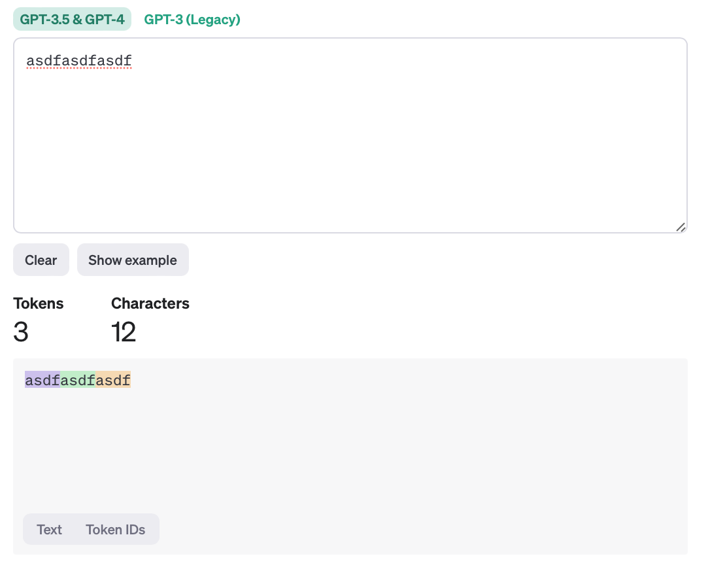
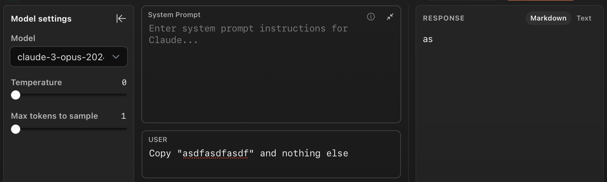
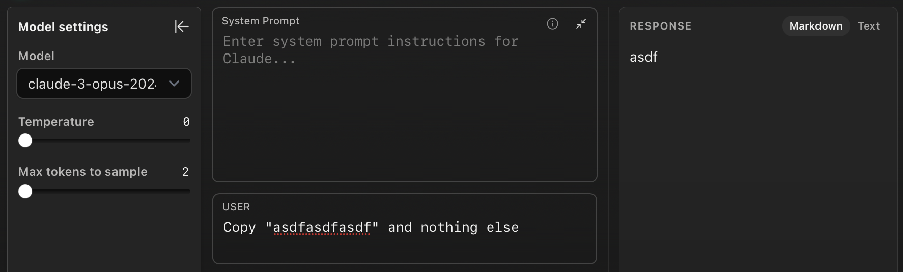
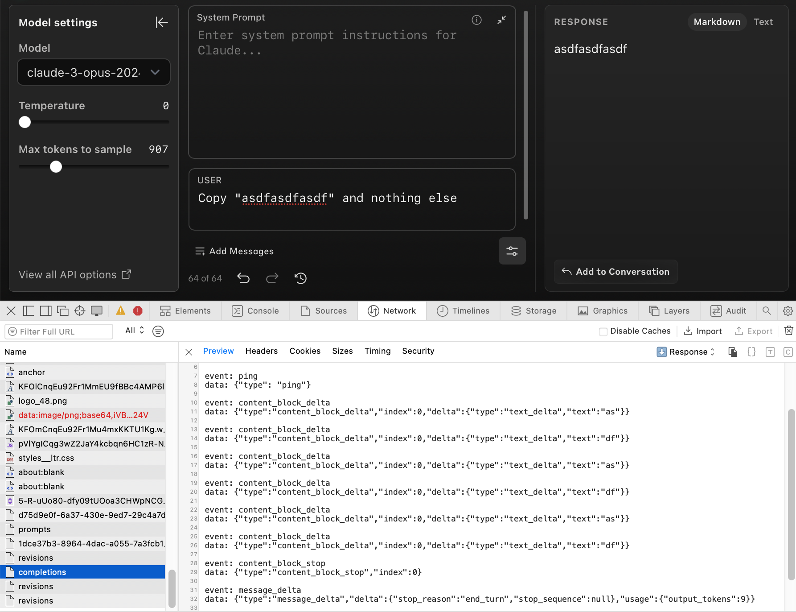

# The (Worst) Claude 3 Tokenizer

_Not an official implementation_

Anthropic recently released [Claude 3](https://www.anthropic.com/news/claude-3-family), but decided not to publicly release the tokenizer used for these model. But no worries, you can reverse-engineer the tokenizer by analyzing the generation streaming.

> 💡 The idea is simple. Ask Claude to repeat some text and just use the generation tokens to find out how your input will be tokenized (under the reasonable assumption of input tokenization being equal to output tokenization).

This is probably the **worst Anthropic tokenizer** (and of course it is not and official implementation). But it can do the trick for experiments where tokenization plays an important role and spending some tokens is not a problem. It is unclear how faithful this tokenization will be but our experiments suggest this is very likely a close approximation.

### How to use

First, create an Anthropic account and obtain your API key. Export your API key as an environment variable:

```bash
export ANTHROPIC_API_KEY=your_api_key
```

⚠️ Running the following commands will consume tokens from your account. ⚠️

**Single string tokenization**

You can quickly tokenize a single string by using the `--text` argument:

```bash
python anthropic_tokenizer.py --text "Security by obscurity is not a good idea."
```

**Batched tokenization**

If you want to tokenize more than one string at a time, you can use the `--file` argument. Specify a JSONL file (e.g. `to_tokenize.jsonl`) containing a `"text"` entry in each line. You can have additional keys that will be preserved after tokenization.

```bash
python src/anthropic_tokenizer.py --file to_tokenize.jsonl
```

This will output a file with name `{FILE_NAME}_tokenized.jsonl.` with 4 additional fields:
* `tokens`: list of tokens in your input text.
* `number_of_tokens`: number of text tokens in your input text.
* `api_total_tokens_usage`: number of tokens as reported by the API. This seems to be always `number_of_tokens + 3`. This may include start and end of sentence tokens.
* `tokenization_correct`: boolean indicating if the tokenized text is equal to the provided text. Use this to verify if tokenization can be trusted for a specific string.

**Keeping track (and share!) your vocabulary**

By default, the above scripts will create (and append lines to) a file called `anthropic_vocab.jsonl`. This file will contain all the tokens you found so far. Since tokens can be repeated across inputs, you can consolidate the file to preserve only unique tokens by running:

```bash
python src/consolidate_vocab.py
```

You can create pull requests (or share via email) your `anthropic_vocab.jsonl` file and will try to keep a consolidated large vocabulary that others can use in this repository.

## Known limitations
* The generation stream seems to merge breaklines and tokens into a single event. For instance, `\n1` will be received in a single stream event, but is very likely tokenized as 2 tokens (according to some experiments limiting the max sampling tokens).

## Motivating Example

I ran several tests to verify whether the traffic is a good proxy for tokenization. It could be possible that the API served text per words or a different unit (e.g. characters).

I took a long string that is unlikely to be a single token: `asdfasdfasdf`

1. I check the tokenization of the OpenAI tokenizer


2. I ask Claude 3 to copy the string **but limiting the maximum number of tokens to 1**


3. I repeat the same but **limiting the maximum number of tokens to 2**


4. If you inspect the network traffic (or the streaming in Python) you will find that `text_delta` is likely to represent a token.

